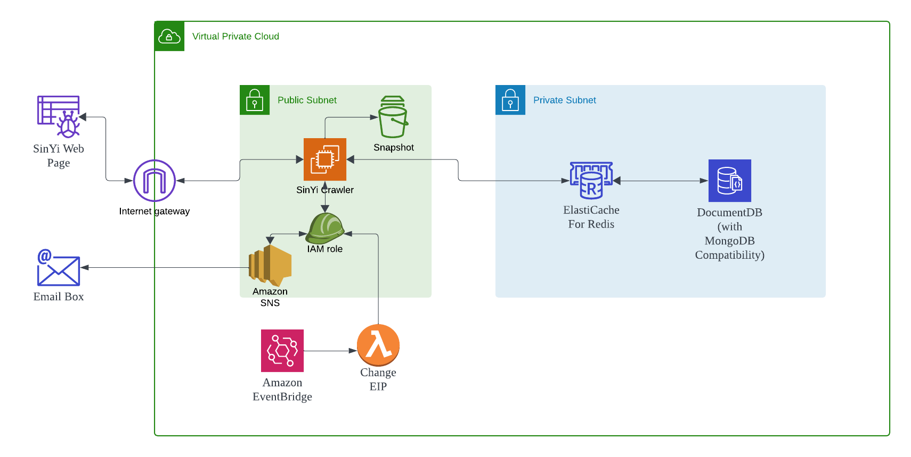

# 信義房屋爬蟲專案

## 專案簡介

信義房屋爬蟲是一個用於抓取台北市信義區房屋資訊的自動化工具。該專案採用 MVC 架構，利用 MongoDB（DocumentDB）作為資料庫，Redis 作為快取和訊息隊列，並透過 AWS SNS 發送通知郵件。此專案旨在自動化收集房屋資訊，分析最近的交通站點，並將相關資訊通過電子郵件通知用戶。

## AWS 架構圖


## 功能特色

- **自動化抓取房屋資訊**：定期從信義房屋網站抓取最新的房屋資訊。
- **整合多個不同捷運站**：在網頁中一個時間只能選取一條線的捷運，此專案可以同時選擇多條不同線的捷運站做搜尋。
- **資料庫管理**：使用 MongoDB 存儲和管理抓取到的房屋資料。
- **快取和隊列處理**：利用 Redis Cluster 進行快取和訊息隊列的管理，提升系統效能。
- **郵件通知**：通過 AWS SNS 將更新的房屋資訊以電子郵件形式發送給用戶。
- **日誌記錄**：詳細的日誌記錄系統運行情況，方便問題排查與維護。

## 目錄結構
```
project/
│
├── certs/
│   └── global-bundle.pem  # 只用於 DocumentDB
│
├── config/
│   ├── config.py          # 配置文件
│   └── logger.py          # 日誌配置
│
├── controllers/
│   └── crawler_controller.py  # 爬蟲控制器
│
├── models/
│   ├── init.py
│   ├── mongo_model.py     # MongoDB 模型
│   └── redis_model.py     # Redis 模型
│
├── views/
│   └── email_view.py      # 電子郵件視圖
│
├── utils/
│   ├── init.py
│   ├── html_fetcher.py    # HTML 抓取器
│   ├── html_parser.py     # HTML 解析器
│   ├── url_generator.py   # URL 生成器
│   └── helpers.py         # 幫助函數
│
├── tests/
│   ├── init.py
│   ├── test_mongo_model.py
│   ├── test_redis_model.py
│   ├── test_html_fetcher.py
│   ├── test_html_parser.py
│   ├── test_url_generator.py
│   └── test_crawler_controller.py
│
├── main.py                # 主程序
│
├── requirements.txt       # 依賴列表
│
└── .env                   # 環境變量
```

## 安裝與配置

### 0. 測試作業系統
```
OS: Ubuntu 24.04
Python: Python 3.12.3
```

### 1. 克隆專案

```
git clone https://github.com/yourusername/sinyi-house-crawler.git
cd sinyi-house-crawler
```

### 2. 建立虛擬環境
建議使用 Python 的虛擬環境來管理依賴。

```
python3 -m venv venv
source venv/bin/activate  # Linux/macOS
```

### 3. 安裝依賴

確保 requirements.txt 文件中包含所有必要的套件，然後執行：
```
pip install -r requirements.txt
```

### 3. 建立 .env 檔案
```
MONGO_USER=
MONGO_PASS=
REDIS_HOST=
REDIS_PORT=6379
REDIS_SSL_CONNECTION=True
REDIS_DB_INSTANCE=0
AWS_REGION=a
SNS_TOPIC_ARN=
LOG_FILE=logs/application.log
```


### 5. 確保虛擬環境已啟動，然後運行主程序：

```
python main.py
```

### 6. 日誌檔案
應用程序的運行情況將被記錄在 logs/main.log 文件中。請定期檢查日誌以監控應用程序狀態。
